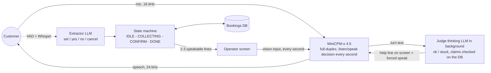

# MiniCPM-o Booking Desk


A full-duplex voice appointment desk on **MiniCPM-o 4.5, vanilla weights**. The speech model keeps listening and
talking; a reasoning LLM and a deterministic state machine behind it run the tools (check, book, cancel) and write a
short **operator screen** that the speech model reads through its vision input, every second, like an operator
reading the CRM. A judge catches false claims. No fine-tuning, no turn-taking: the reasoning never sits in the audio
path, and the caller never waits for a turn.

**This branch: `vision-booking`.** The operator screen is rendered as a frame and sent through the model's video
input. The sister branch [`text-booking`](../../tree/text-booking) sends the same screen as plain text in the vision
slot, with no image encoding, and behaves the same. The two branches differ only in that channel.

## 1. Demo (3 minutes) VIDEO

▶ **[Demo video: booking and cancelling with real interruptions, database on screen](https://youtu.be/Yx80VoA8Vw4)** — link to be added.

Recorded on one RTX 5090 (32 GB), headset, English, no editing inside a conversation.

## 2. Where this sits

MiniCPM-o 4.5 is the front model here because it is open, runs on one consumer GPU, and exposes the two hooks this
design needs (a per-unit speak/listen decision and a KV cache we can window). It is not the last word in full-duplex
models: **DuplexOmni** (Huang et al., 2026, [arXiv:2606.09186](https://arxiv.org/abs/2606.09186)) puts real-time
*thinking* next to listening, seeing and speaking inside the model, and looks like a stronger base for this kind of
agent. Paper review: [DuplexOmni: Real-Time Listening, Seeing, Thinking, and Speaking for Full-Duplex Interaction (YouTube)](https://www.youtube.com/watch?v=gF6c_6aa35I).
Nothing below depends on the front model beyond those two hooks, so the orchestration should carry over.

## 3. What it does

The customer talks to the desk. The desk asks for month, day and time, checks the calendar, proposes a slot when the
customer says "you pick", books only after an explicit yes, and cancels an existing booking, again only after a yes.
The bookings database is visible on a second page and is written by code only, never by a model.

## 4. How it works



#### State machine:


Three channels, each used for what the model was trained on:

- **Audio is only the customer.** No synthetic voice, no injected audio. The model's natural trigger to speak is
  acoustic.
- **Vision is the operator screen.** Two or three lines, all of them sentences the operator can say to the customer
  as they are (`BOOK: APRIL` / `WHICH DAY?`; `APRIL 20, 2 PM` / `FREE` / `SHALL I BOOK IT?`; `BOOKED` /
  `ANYTHING ELSE?`). Never an instruction to the operator: with a forced turn the model reads the screen literally,
  so `SAY: AVAILABLE` became "I'm going to say available". The screen is state, not a message: it updates while the
  model keeps talking, and the model reads whatever is there when it decides to speak.
- **Control tokens are the "when".** Upstream has `force_listen`; we added its mirror `force_speak`
  (`MiniCPMO45/modeling_minicpmo_unified.py`): at the first decision of a unit with a closed turn, `<|listen|>` becomes
  `<|speak|>` and decoding continues normally. Measured: the turn opens in 0.5-1.2 s in 11 cases out of 12.

The loop for each customer line:

1. Browser VAD closes the line (300 ms of silence) → Whisper large-v3-turbo transcribes it → the **extractor**
   (a small cloud LLM, `google/gemini-3.5-flash-lite`, OpenAI-compatible endpoint) emits one event: `set` (values
   said, never writes), `yes` (the only event that writes, and it must quote the words that accept), `no`, `cancel`.
2. The **state machine** (`gateway.py`) merges the record, validates the fields, checks the day or the month on the
   DB, proposes a slot on "you pick", books or cancels only on `yes`, and is idempotent (same record, no event).
3. The **screen** changes; the model answers from the voice and reads the screen, 1.5-3 s after the customer's line.
4. At the end of each model turn (and 3 s after a customer line with no answer) the **judge** (same LLM, whole
   conversation + screen + state + timings + the desk's contract) returns `ok` or `stuck` (silent, off context,
   repeating, ignores screen, false claim, cannot do), a help line to say, and the claims it heard.
5. **Claims are verified by code on the DB**, never by the LLM: "I've booked it" before a yes → red
   `NOTHING BOOKED YET`; "3 pm is free" when it is taken → red `3 PM IS TAKEN`. Stuck or red → the help line goes on
   the screen and the next chunk carries `force_speak`, so the model opens a turn and says it.
6. Guards, all measured on live runs: one help between two customer lines, at most two per state, 6 s between
   forces, stale verdicts dropped if the machine changed meanwhile, never a force in the first 3 chunks or while a
   turn is open. A judge check also runs mid-turn: a turn that lists days or loops is cut at ~11 s with
   `force_listen`, then corrected.
7. The **KV cache** is windowed per session (basic, 4000 → 3500 tokens, system prompt preserved): upstream lets it
   grow to the model limit and the conversation dies after a few minutes.

## 5. Results, in numbers

Reference live sessions (recorded run registries, timings from the logs):

| session | length | bookings written | wrong writes | judge forces | reds | notes |
|---|---|---|---|---|---|---|
| `sess_20257233a096` (8 Sep) | 4 min 13 s | 2 (April 4 3 PM, November 15 6 PM) | 0 | 4, all justified | 0 | "you pick" proposed a day, mid-turn check let a healthy 12 s turn finish |
| `sess_f0ab8867fc79` (7 Sep) | 2 min 43 s | 1 | 0 | 3, all justified, 0 false on fillers | 1, corrected by voice within 1 s | month lookup read once, partial day read with the right polarity |

Latencies on those runs: extractor 1.0-1.4 s, judge 0.8-1.2 s, forced turn opens 0.6-0.7 s after the chunk,
model reads a new screen 1.5-3 s after the customer's line. Screen frames: 448×448, one per second.

Benches (no GPU needed for the first two):

| bench | command | result |
|---|---|---|
| normaliser / validator (times, dates) | `python tools/test_norm.py` | 40/40 |
| state machine replay (recorded scenarios + regression cases) | `python tools/fsm_replay_test.py` | 76/76 |
| extractor regression (sentence + state → event) | `python tools/tool_agent_eval.py` | 58/58 with gemini-3.5-flash-lite |
| extractor with dialogue context ("yes", "that day") | `python tools/tool_agent_eval_dialog.py` | 28/28 |
| judge probes (proposals, stale help, screen question) | `python tools/sigma_probe.py` | 20/20 |

Three alternatives were measured for the extractor and not taken: a constrained-decoding local Qwen3-1.7B (44/55
against 47/55 free; it invents values to fill the JSON), Nemotron 3 Nano (48/58 at 1.2 s against 52/58 at 0.9 s for
flash-lite, before the harness fix), Claude Sonnet 5 (+3 points, 2.5 s per call, too slow for the loop).

## 6. What failed, and what it taught

The full account is in [docs/WRITEUP.md](docs/WRITEUP.md). The short list:

- **Screens alone never woke the model** (every session up to 6 Sep): a frame is not a trigger to speak. Hence
  `force_speak`; not a longer prompt, not a banner, not synthetic audio.
- **Text injected in the model's output slot is spoken as its own words** ("do you like cats" → "I like cats");
  text in the system region is background, not an order. Hence the screen goes through perception.
- **A timed policy** (force on every event frame, latch, 3.5 s watchdog) talked too much and answered twice. Replaced
  by the judge, which decides from the conversation.
- **Operator instructions on the screen are read literally.** Only customer-facing sentences survive.
- **Native tool calling on MiniCPM-o 4.5 does not work**: the tokenizer has the Qwen3 `<tool_call>` template, but
  the model invents the answer instead of calling (3 probes). Hence the separate extractor.
- **An explicit STUCK state in the machine** (13 Sep) made things worse: forces beat the caps and the model talked on
  its own. Dropped; the judge's help line plus guards is the working shape.

## 7. Limits

- The decision granularity is 1 s (one unit), so every correction lands in the next second, not the next 100 ms.
- English only. The prompt is one line: *"You are in duplex mode, where you can listen and speak at the same time.
  You are the operator of an appointment booking desk. Follow the instructions on the SCREEN, always repeat dates for
  confirmation."*
- Headset required: there is no echo cancellation between the model's voice and the microphone.
- The extractor and the judge are cloud calls (OpenAI-compatible endpoint); a local Qwen3-1.7B fallback exists and
  scores lower (48/55).
- Occasional non-English phonemes after fillers on very short turns, from the speech decoder; accepted.

## 8. Running it

Hardware: one GPU with 32 GB (tested on an RTX 5090 under WSL2; ~29 GB used with the `turbo` profile).
Software: Python 3.10, PyTorch with CUDA, `pip install -r requirements.txt`, plus `openai-whisper` for the side ASR
(same environment, or another one through `ASR_PYTHON`).

1. Weights: `models/MiniCPM-o-4_5` from [openbmb/MiniCPM-o-4_5](https://huggingface.co/openbmb/MiniCPM-o-4_5).
   Optional `models/Qwen3-1.7B` for the local extractor fallback (`HUD_ASR=small`).
2. Extractor / judge endpoint, in `~/.config/tool_agent.env` or `.env` in the repository root:
   ```
   TA_API_KEY=...
   TA_BASE_URL=https://api.cline.bot/api/v1      # any OpenAI-compatible endpoint
   TA_MODEL=google/gemini-3.5-flash-lite
   ```
3. Launch everything (backend, side ASR, extractor/judge, worker, gateway; the backend loads in ~4 min):
   ```bash
   bash tools/run_desk.sh
   ```
4. Open `https://localhost:8006/static/hud/hud.html` (self-signed certificate), put on headphones, choose the
   microphone, press **Start session**. The bookings are at `https://localhost:8006/static/hud/db.html`.
5. Read a run afterwards: `python tools/hud_run_log.py --conv` (registry in `logs_demo/hud_runs/`).

The HUD page also shows the state graph, the last judge verdict, the forces and the frames sent, and offers a manual
request panel (no voice) to drive the machine by hand.

## 9. Repository map

| path | what |
|---|---|
| `gateway.py` | upstream gateway + the desk: state machine, bookings DB, screens, judge routing (`_hud_*`, from line ~750) |
| `static/hud/` | operator screen page (`hud.html`, `hud-app.js`), bookings view (`db.html`) |
| `tools/tool_agent_server.py` | extractor + judge service (cloud or local) |
| `tools/asr_server.py`, `tools/switch_asr_profile.sh` | side ASR (Whisper) and its profile |
| `tools/run_desk.sh` | launcher |
| `MiniCPMO45/` | upstream model code with our changes: `force_speak` override, per-session KV sliding window (`set_sliding_window`, `window_stats`), text injection hooks, decoder fixes (temperature applied to chunk end, repetition-penalty sign, `<|listen|>` token id, word-aligned chunk cuts) |
| `core/`, `py_backend/`, `static/duplex/` | plumbing of the new session fields (`force_speak`, `sliding_window_*`) |
| `tools/*_eval*.py`, `fsm_replay_test.py`, `sigma_probe.py`, `test_norm.py` | benches above |
| `docs/WRITEUP.md` | what worked, what failed, with numbers |
| `docs/UPSTREAM_README.md`, `docs/en/` | the original demo system's README and docs |

Inline comments are partly in Italian, as upstream's are partly in Chinese; every module header, script usage and
user-facing string is in English.

## 10. Credits

Built on [OpenBMB/MiniCPM-o-Demo](https://github.com/OpenBMB/MiniCPM-o-Demo) (base commit `50b0865`) and the
[MiniCPM-o 4.5](https://huggingface.co/openbmb/MiniCPM-o-4_5) model; see those projects for their licences. Whisper by
OpenAI. The desk, the screens, the judge and the model changes are this repository's work.
